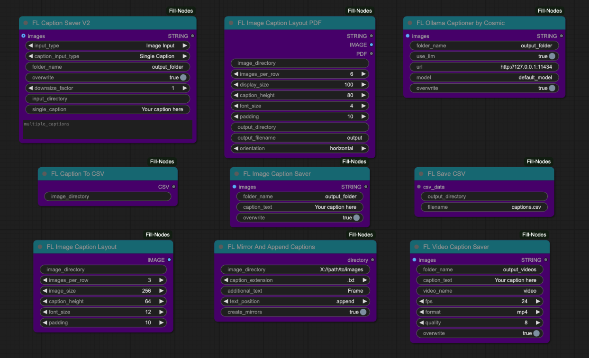
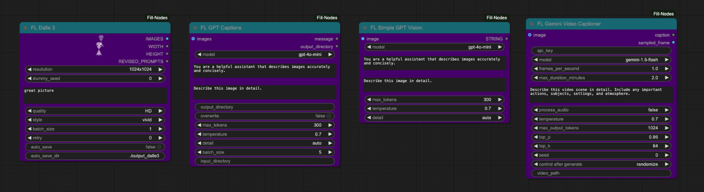

# 🏵️ Fill-Nodes

If you enjoy this project, consider supporting me on Patreon!

  

Fill-Nodes is a versatile collection of custom nodes for ComfyUI that extends functionality across multiple domains. Features include advanced image processing, visual effects generation, comprehensive file handling (PDF creation/extraction, Google Drive integration), AI model interfaces (GPT, DALL-E, Hugging Face, Runway, Gemini, Fal.ai, and more), utility nodes for workflow enhancement, audio-reactive visual effects, and specialized tools for video processing, captioning, and batch operations. The pack provides both practical workflow solutions and creative tools within a unified node collection.

## 🔍 Table of Contents

<table>
  <tr>
    <td valign="top">
      <ul>
        <li><a href="#image-nodes">🖼️ Image Nodes</a></li>
        <li><a href="#captioning-nodes">📝 Captioning Nodes</a></li>
        <li><a href="#vfx-nodes">✨ VFX Nodes</a></li>
        <li><a href="#utility-nodes">🛠️ Utility Nodes</a></li>
        <li><a href="#ksamplers-nodes">🎲 KSamplers Nodes</a></li>
        <li><a href="#pdf-nodes">📄 PDF Nodes</a></li>
        <li><a href="#gpt-nodes">🤖 GPT Nodes</a></li>
      </ul>
    </td>
    <td valign="top">
      <ul>
        <li><a href="#ai-nodes">🧠 AI Nodes</a></li>
        <li><a href="#audio-nodes">🔊 Audio Nodes</a></li>
        <li><a href="#experimental-nodes">🧪 Experimental Nodes</a></li>
        <li><a href="#prompting-nodes">💬 Prompting Nodes</a></li>
        <li><a href="#file-operation-nodes">📂 File Operation Nodes</a></li>
        <li><a href="#google-drive-nodes">☁️ Google Drive Nodes</a></li>
        <li><a href="#api-tool-nodes">🔌 API Tool Nodes</a></li>
      </ul>
    </td>
    <td valign="top">
      <ul>
        <li><a href="#hugging-face-nodes">🤗 Hugging Face Nodes</a></li>
        <li><a href="#loader-nodes">⏬ Loader Nodes</a></li>
        <li><a href="#discord-nodes">💬 Discord Nodes</a></li>
        <li><a href="#work-in-progress-nodes">🚧 Work-in-Progress Nodes</a></li>
        <li><a href="#game-nodes">🎮 Game Nodes</a></li>
        <li><a href="#video-nodes">🎬 Video Nodes</a></li>
      </ul>
    </td>
  </tr>
</table>

---

<h2 id="-image-nodes">🖼️ Image Nodes</h2>

> *Nodes for manipulating, analyzing, and working with images.*

| Node | Description |
|------|-------------|
| `FL_AnimeLineExtractor` | Extracts line art from images using OpenCV's adaptive thresholding and morphological operations. Provides controls for line threshold, line width, detail level, noise reduction via Gaussian blur, and optional output inversion for white backgrounds. |
| `FL_ApplyMask` | Applies a mask to an image's alpha channel by adding or modifying the alpha channel based on the provided mask. Automatically handles dimension mismatches between image and mask through interpolation and supports batch processing. |
| `FL_BlackFrameReject` | Filters out images from a batch based on black pixel percentage using configurable threshold and black level detection. Supports multiple detection methods (luminance, average, RGB, all channels) and optional inversion logic, returning filtered images with count statistics. |
| `FL_ImageAddNoise` | Adds random Gaussian noise to images with controllable strength (0.0-1.0) and seed for reproducible results. Uses torch.randn to generate noise and clips output to valid 0.0-1.0 range. |
| `FL_ImageAddToBatch` | Combines two image batches into a single batch by concatenating them. Automatically resizes the second batch to match the first batch's dimensions using bicubic or area interpolation based on scaling direction. |
| `FL_ImageAdjuster` | Adjusts image properties including hue rotation (-180 to 180), saturation, brightness, contrast (all -100 to 100), and sharpness (0 to 100) using PIL's ImageEnhance. Converts to HSV for hue/saturation adjustments and applies UnsharpMask filter for sharpness, with real-time preview sent to the frontend. |
| `FL_ImageAspectCropper` | Crops images to a target aspect ratio (specified as width:height) by center-cropping either width or height as needed. Ensures resulting dimensions are even numbers for compatibility with video codecs. |
| `FL_ImageBatch` | Dynamically combines multiple images into a single batch with configurable number of inputs (2-100). Uses ComfyUI's ImageBatch node internally and automatically resizes images to match the first image's dimensions. |
| `FL_ImageBatchToGrid` | Arranges a batch of images into a grid layout with a specified number of images per row. Creates a single composite image with black background filling any empty grid positions. |
| `FL_ImageBlank` | Creates a blank image with specified width, height, and RGB color values. Generates a solid color image as a tensor suitable for use in ComfyUI workflows. |
| `FL_ImageCrop` | Crops images from specified directions (top, bottom, left, right, or combinations) by a specified pixel amount. Automatically validates crop amounts to prevent exceeding image dimensions. |
| `FL_ImageDimensionDisplay` | Extracts and returns the width and height dimensions of an input image as a formatted string. Supports both tensor and PIL image formats. |
| `FL_ImageListToImageBatch` | Converts a list of individual images into a single batched image tensor. Automatically resizes images to match the first image's dimensions using Lanczos interpolation if needed. |
| `FL_ImageNotes` | Adds a text bar with custom text to images, positioned at top or bottom. Supports configurable bar height, text size, borders, and optional word wrapping with automatic height adjustment to fit wrapped text. |
| `FL_ImageRandomizer` | Randomly selects an image or video from a specified directory based on a seed value (using modulo operation for deterministic selection). Supports subdirectory searching and returns the selected media as a batch along with the file path and filename. |
| `FL_ImageSelector` | Selects specific images from a batch using comma-separated indices or the 'last' keyword. Returns a new batch containing only the specified images in the order they were listed. |
| `FL_ImageSlicer` | Divides an image into a grid of equally-sized rectangular slices based on x and y subdivision counts. Returns all slices as a batch of images, processing from left-to-right, top-to-bottom. |
| `FL_LoadImage` | Provides a file browser interface for loading images from a custom directory structure with server-side API endpoints. Converts RGBA images to RGB with white background compositing and handles various image formats. |
| `FL_PaddingRemover` | Detects and removes uniform padding from images by analyzing edge colors and their consistency across rows and columns. Supports CPU and GPU processing modes, configurable tolerance, minimum content size constraints, and additional manual trimming options with optional debug visualization. |
| `FL_ReplaceColor` | Replaces pixels of a specific source color with a target color using Euclidean distance in RGB space and configurable tolerance. Supports morphological operations (expand/contract) to dilate or erode the replacement area using circular kernels. |
| `FL_SaveImages` | Saves images to a custom folder structure with templated filenames and automatic index incrementing to avoid overwriting. Supports optional metadata saving as separate text files alongside images. |
| `FL_SaveRGBAAnimatedWebP` | Saves animated WebP files from separate RGB and alpha channel image batches with configurable FPS, quality, and encoding method. Creates a preview with checkerboard background for transparency visualization and exports both the WebP animation and a ZIP file containing individual PNG frames with alpha. |
| `FL_SaveWebM` | Exports image batches as WebM video files using VP9 codec with configurable FPS, quality, and optional alpha channel preservation. Uses imageio with ffmpeg backend and includes fallback handling for encoding errors. |

### 📷 Screenshots & Examples

---

<h2 id="-captioning-nodes">📝 Captioning Nodes</h2>

> *Nodes for generating, saving, and manipulating image and video captions.*

| Node | Description |
|------|-------------|
| `FL_CSVExtractor` | Extracts a specific column value from a randomly selected CSV row using a seed-based selection mechanism, supporting header skipping and returning the extracted text, row number, and full row data. Uses modulo-based pseudo-random selection for reproducible results. |
| `FL_CaptionSaver_V2` | Advanced caption saver supporting both image tensor input and directory input modes with single or multiple caption options, optional mask image saving, and configurable downsize factors. Provides flexible caption assignment with automatic list extension/truncation and unique filename generation when overwrite is disabled. |
| `FL_CaptionToCSV` | Scans an image directory and creates an in-memory CSV mapping image filenames to their corresponding caption text files. Returns CSV data as UTF-8 encoded bytes containing image_file and caption columns. |
| `FL_ImageCaptionLayout` | Creates a visual grid layout combining images with their caption files from a directory, generating a single composite image with configurable rows, image sizes, padding, and caption boxes. Returns a PyTorch tensor suitable for display in ComfyUI. |
| `FL_ImageCaptionLayoutPDF` | Generates both a PDF document and an image preview displaying a grid of images with captions from a directory, supporting pagination for multiple pages with configurable layout dimensions, orientation, and font settings. Uses ReportLab for PDF generation and PIL for image preview creation. |
| `FL_ImageCaptionSaver` | Saves a batch of images and their associated caption text to a specified folder, sanitizing captions by removing special characters and supporting optional file overwrite prevention. Handles tensor-to-image conversion with automatic grayscale-to-RGB conversion and proper value normalization. |
| `FL_LoadCSV` | Loads a CSV file from disk and returns both the raw binary data and row count for use in other nodes. Validates file existence, extension, and provides modification time tracking for cache invalidation. |
| `FL_MirrorAndAppendCaptions` | Processes images in a directory by appending frame numbers to captions and optionally creating horizontally mirrored duplicates with sequential frame numbering. Supports prepending or appending custom text to captions and saves both original and mirrored versions back to the directory. |
| `FL_OllamaCaptioner` | Generates image captions using Ollama LLM by encoding images as base64 and sending them to a local Ollama server for description generation. Saves images with either AI-generated or default captions, supporting custom model selection and URL configuration. |
| `FL_SaveCSV` | Writes CSV data (received as bytes) to a specified file path, automatically creating output directories and ensuring proper .csv extension. Provides file writing with error handling and console logging for save confirmation. |
| `FL_VideoCaptionSaver` | Converts a sequence of image tensors into a video file (MP4 or AVI) using OpenCV with configurable FPS and quality settings, while saving an associated caption text file. Handles RGB-to-BGR conversion, frame processing with progress tracking, and supports overwrite prevention. |
| `FL_WordFrequencyGraph` | Analyzes all text files in a directory to generate a horizontal bar graph visualization of word frequency statistics with customizable color schemes, word filtering options, and configurable output dimensions. Excludes common stop words and produces a dark-themed matplotlib graph as a PyTorch tensor. |

### 📷 Screenshots & Examples

---

<h2 id="-vfx-nodes">✨ VFX Nodes</h2>

> *Nodes for applying visual effects to images.*

| Node | Description |
|------|-------------|
| `FL_Ascii` | Converts images to ASCII art by sampling pixels at regular intervals and mapping them to custom character sets, with options for sequential or brightness-based character selection, configurable spacing, font, and font size. |
| `FL_Dither` | Applies various dithering algorithms (Floyd-Steinberg, Random, Ordered, Bayer) to reduce images to a specified number of colors, creating retro-style color quantization effects with configurable color palette sizes from 2-256 colors. |
| `FL_Glitch` | Creates digital glitch effects using the glitch_this library with controllable glitch intensity and optional RGB color channel offset, applying effects both horizontally and vertically by rotating the image 90 degrees during processing. |
| `FL_HalftonePattern` | Generates halftone dot patterns by converting images to grayscale and creating circular dots of varying sizes based on region brightness, with configurable dot size and spacing parameters for newspaper-print style effects. |
| `FL_HexagonalPattern` | Creates mosaic-style images by tiling hexagonal crops of the input with configurable shadow effects, background color, rotation, and spacing using PIL's polygon drawing capabilities. |
| `FL_ImageCollage` | Generates photomosaics by tiling a template image across the base image, colorizing each tile based on the average color of the corresponding base region, with configurable tile size and spacing. |
| `FL_ImagePixelator` | Applies pixelation effects with morphological gradient edge detection using Kornia, featuring configurable scale factor, kernel size, and sine-wave modulation for animated pixelation intensity across image sequences. |
| `FL_InfiniteZoom` | Produces infinite zoom/droste effects using OpenGL shaders with GLFW, supporting configurable scale, mirror/swirl parameters, iteration count, and animation speed to create recursive visual patterns. |
| `FL_PaperDrawn` | Simulates hand-drawn sketch effects using OpenGL fragment shaders that apply directional gradient analysis with configurable angle count, sampling density, line width, and vignette strength to create pencil-drawn aesthetics. |
| `FL_PixelArtShader` | Creates pixel art effects by downsampling images with nearest-neighbor interpolation, applying color quantization, and optionally mapping to extracted color palettes using K-means clustering with mask support. |
| `FL_PixelSort` | Implements pixel sorting effects based on HSV saturation values, sorting pixels within detected edge intervals either horizontally or vertically with configurable threshold, smoothing, and rotation parameters. |
| `FL_RetroEffect` | Creates vintage CRT monitor effects by applying RGB color channel offset, scanline overlay, radial vignette with gaussian blur, and random noise blending using PIL image processing techniques. |
| `FL_Ripple` | Generates radial ripple/wave distortion effects using sinusoidal displacement mapping based on distance from a configurable center point, with adjustable amplitude, frequency, phase, and optional sine-wave modulation. |
| `FL_Shadertoy` | Renders Shadertoy-compatible GLSL shaders using OpenGL with support for up to 4 input image channels, iResolution/iTime/iFrame uniforms, and configurable frame count/FPS for shader-based generative effects. |
| `FL_TextOverlayNode` | Overlays customizable text on images with support for TrueType fonts (system or local), configurable RGB color, percentage-based positioning, multiple anchor points (9 positions), and multiline text rendering using PIL ImageDraw. |

### 📷 Screenshots & Examples

---

<h2 id="-utility-nodes">🛠️ Utility Nodes</h2>

> *General utility nodes for various tasks.*

| Node | Description |
|------|-------------|
| `FL_ClipScanner` | Tokenizes text prompts using OpenCLIP tokenizers for different model types (SDXL ViT-G/14, SD 1.5 ViT-L/14, FLUX ViT-L/14) and displays detailed token analysis including token count and decoded output. |
| `FL_CodeNode` | Executes arbitrary Python code provided as string input or loaded from file, with four generic output slots and dynamic input support via inputs/outputs dictionaries for custom algorithm integration. |
| `FL_DirectoryCrawl` | Recursively crawls directories to batch-load images or text files with progress tracking, returning images as both batched tensors (padded) and individual image lists for flexible processing. |
| `FL_Float` | Outputs a float value rounded to 2 decimal places, serving as a simple float constant provider for workflows. |
| `FL_InpaintCrop` | Crops images based on mask bounding boxes with multiple sizing modes (free, forced, range, long/short side) including context expansion, optional hole filling (CPU/GPU), and generates stitch data for recomposition. |
| `FL_Inpaint_Stitch` | Stitches inpainted images back into their original positions using crop data from FL_InpaintCrop, handling rescaling and alpha compositing to blend processed regions seamlessly. |
| `FL_JS` | Executes custom JavaScript code in response to ComfyUI workflow events (before_queued, after_queued, executing, executed, etc.) for client-side scripting integration. |
| `FL_Math` | Evaluates mathematical expressions with up to three variables (A, B, C) using safe AST parsing, supporting basic arithmetic operators (add, subtract, multiply, divide, power) and returning both integer and float results. |
| `FL_ModelInspector` | Inspects PyTorch checkpoint files (.ckpt, .safetensors) and extracts comprehensive information including parameter count, layer shapes, architecture analysis, and model structure with support for various loading methods and fallback mechanisms. |
| `FL_Padding` | Adds customizable padding to images on all four sides with configurable RGB color, optional alpha channel, and proper tensor handling for batched processing. |
| `FL_PasteByMask` | Pastes images onto base images at mask locations with advanced features including multiple resize behaviors (resize, keep_ratio_fill/fit, source_size), blend modes (normal, multiply, screen, overlay, etc.), feathering, and mask mapping support for batch processing. |
| `FL_PasteOnCanvas` | Pastes and centers masked images onto a canvas of specified dimensions with optional background color/image, supporting multiple resize algorithms (bilinear, nearest, bicubic, lanczos), padding, and alpha channel handling. |
| `FL_PathTypeChecker` | Analyzes file path strings to determine their type (absolute, relative, UNC, URL-like, drive-specific) with validation and classification logic. |
| `FL_RandomNumber` | Generates random integer and float values within specified ranges using seed-based reproducibility, with automatic seed generation when seed is 0. |
| `FL_SDUltimate_Slices` | Calculates slice dimensions for SD Ultimate upscaling by dividing images into configurable grid patterns (1x1 to 4x4) with multiplier support for slice size adjustment. |
| `FL_SeparateMaskComponents` | Separates multi-component masks into individual connected components using OpenCV's connected component labeling, returning separated masks and a mapping tensor for batch tracking. |
| `FL_Switch` | Implements lazy-evaluated boolean switch that evaluates and returns either on_true or on_false input based on switch value, enabling conditional workflow execution without evaluating unused branches. |
| `FL_Switch_Big` | Implements lazy-evaluated multi-case switch logic (5 cases + default) by comparing a switch condition against case strings and evaluating only the matched input path for conditional workflow branching. |
| `FL_SystemCheck` | Gathers and exposes system information including Python version, OS, CPU, RAM, GPU, library versions (PyTorch, transformers, etc.), and environment variables via an HTTP endpoint. |
| `FL_UnloadModel` | Removes models from memory and clears CUDA cache by unloading specified models from ComfyUI's model management system, with passthrough capability for workflow continuity. |
| `FL_VideoCropMask` | Crops video frames based on mask bounding boxes with temporal smoothing, maintaining aspect ratio and optionally applying padding, returning cropped video, mask, and crop data for each frame. |
| `FL_VideoRecompose` | Replaces cropped regions back into original video frames using crop data from FL_VideoCropMask, resizing processed frames to match original crop dimensions. |

### 📷 Screenshots & Examples

---

<h2 id="-ksamplers-nodes">🎲 KSamplers Nodes</h2>

> *Nodes for sampling in the generation process.*

| Node | Description |
|------|-------------|
| `FL_KSamplerXYZPlot` | Grid comparison sampler that generates parameter sweep visualizations by iterating over X/Y axis values (steps, CFG, denoise, sampler, or scheduler) with optional Z-axis stacking (vertical/horizontal), producing labeled image grids with axes and parameter annotations for systematic parameter testing. |
| `FL_KsamplerBasic` | Simplified sampler node that accepts either latent or image input (with VAE encoding), performs standard KSampler operations with configurable steps/CFG/sampler/scheduler/denoise parameters, and outputs both latent and decoded image results. |
| `FL_KsamplerPlus` | Advanced tiled sampler that divides latent or image inputs into overlapping grid slices (configurable X/Y slices and overlap), processes each tile with optional region-specific conditioning (including ControlNet cropping), and blends results using cosine-weighted masks to eliminate seams. |
| `FL_KsamplerPlusV2` | Enhanced version of FL_KsamplerPlus with additional features including user-configurable conditioning strength multiplier, complete conditioning split across tiles (including pooled outputs and tensor-based conditioning), batch processing support for sliced conditioning, and optional debug information output. |
| `FL_KsamplerSettings` | Configuration node that outputs sampling parameters including aspect ratio dimensions (SD/XL/SVD presets with landscape/portrait rotation), batch size, two-pass step counts, CFG scales, denoise strength, scale factor, and sampler/scheduler selection. |
| `FL_SamplerStrings` | String generator node with boolean toggles for 27 sampler types (euler, dpm, heun, ddim, etc.) that outputs a comma-separated string of selected sampler names for batch processing workflows. |
| `FL_SchedulerStrings` | String generator node with boolean toggles for 7 scheduler types (normal, karras, exponential, sgm_uniform, simple, ddim_uniform, beta) that outputs a comma-separated string of selected scheduler names for batch processing workflows. |

### 📷 Screenshots & Examples

---

<h2 id="-pdf-nodes">📄 PDF Nodes</h2>

> *Nodes for working with PDF files.*

| Node | Description |
|------|-------------|
| `FL_BulkPDFLoader` | Loads all PDF files from a specified directory path and returns them as a list of PDF data objects containing file metadata (path, filename, page count) and binary content. Validates that PDFs exist and can be read, collecting errors for any failed loads. |
| `FL_ImagesToPDF` | Converts ComfyUI image tensors into a single PDF document with configurable DPI and page size (A4/Letter/Legal), automatically scaling and centering each image to fit the page while maintaining aspect ratio. Returns an in-memory PDF data object. |
| `FL_PDFEncryptor` | Encrypts a PDF with user and owner passwords using PyPDF2, supporting 40-bit or 128-bit encryption with granular permission controls (printing, copying, commenting, form filling, assembly, content extraction). Returns an encrypted in-memory PDF data object. |
| `FL_PDFImageExtractor` | Extracts embedded images from PDF pages that meet minimum width/height thresholds, handling multiple compression formats (DCTDecode/JPEG, FlateDecode/PNG, JPXDecode/JPEG2000, LZWDecode). Returns extracted images as normalized PyTorch tensors in batch format [B, H, W, C]. |
| `FL_PDFLoader` | Loads a single PDF file from a specified file path and returns it as a PDF data object containing the file path, page count, and binary content. Validates file existence and PDF format before loading. |
| `FL_PDFMerger` | Merges two PDF data objects into a single combined PDF using PyPDF2's PdfMerger, appending the second PDF after the first. Returns the merged PDF as an in-memory data object with total page count. |
| `FL_PDFSaver` | Saves a PDF data object to disk at a specified directory path with a given filename, automatically creating the output directory if needed and appending '.pdf' extension if not present. Returns the full output file path. |
| `FL_PDFTextExtractor` | Extracts all text content from a PDF document by iterating through pages using PyPDF2's text extraction, combining text from all pages with double newlines as page separators. Returns the extracted text as a single string. |
| `FL_PDFToImages` | Converts PDF pages to images using PyMuPDF (fitz) with configurable DPI resolution, supporting both single PDFs and lists of PDFs. Returns all pages as normalized PyTorch image tensors concatenated into a single batch. |
| `FL_TextToPDF` | Generates a PDF document from plain text input using ReportLab canvas, with configurable page size, font size, margins, and title, automatically handling text wrapping and pagination. Returns an in-memory PDF data object with calculated page count. |

### 📷 Screenshots & Examples

---

<h2 id="-gpt-nodes">🤖 GPT Nodes</h2>

> *Nodes for integrating with GPT and OpenAI models.*

| Node | Description |
|------|-------------|
| `FL_Dalle3` | Generates images using OpenAI's DALL-E 3 model with asynchronous batch processing, caching results based on parameters to avoid redundant API calls, and returns image tensors along with revised prompts. Supports auto-save functionality with metadata JSON files and configurable retry logic for API failures. |
| `FL_GPT_Image1` | Generates or edits images using OpenAI's gpt-image-1 model with support for batch generation, image editing with optional masks, and comprehensive error handling that creates error images with visual text feedback. Implements retry logic, multipart form-data for edits endpoint, and processes both base64 and URL-based image responses. |
| `FL_GPT_Image1_ADV` | Advanced multi-input variant that generates multiple images concurrently using OpenAI's gpt-image-1 model by processing up to 100 prompts with individual image inputs for editing in parallel using async/await and thread pool execution. Each input slot can have its own prompt and optional image, with all outputs combined into a batched tensor and detailed per-call response logs. |
| `FL_GPT_Text` | Makes synchronous API calls to OpenAI's GPT models (GPT-4, GPT-3.5-turbo) for text completion with full parameter control including temperature, top_p, and frequency/presence penalties. Optionally saves responses to file and falls back to environment variable for API key if not provided. |
| `FL_GPT_Vision` | Batch processes images using OpenAI's GPT-4 Vision models to generate captions asynchronously with configurable batch sizes, supporting both input directories and image tensors, and saves captions to text files alongside images. Retrieves API key from environment variable OPENAI_API_KEY. |
| `FL_SimpleGPTVision` | Sends a single image to OpenAI's GPT-4 Vision API to generate a text caption based on configurable system and user prompts, with built-in rate limiting retry logic using exponential backoff. Returns the generated caption as a string output. |

### 📷 Screenshots & Examples

---

<h2 id="-ai-nodes">🧠 AI Nodes</h2>

> *Nodes that integrate with various AI models and services.*

| Node | Description |
|------|-------------|
| `FL_Fal_Gemini_ImageEdit` | Edits up to 5 input images using Fal AI Gemini 2.5 Flash Image Edit API with multimodal prompt support, async processing, and automatic image URL generation. Returns edited images with URLs and description. |
| `FL_Fal_Kling_AIAvatar` | Generates AI avatar videos using Fal AI Kling Video API by combining input image with audio tensor or image sequence, with optional text prompt refinement. Returns extracted video frames and original audio. |
| `FL_Fal_Kontext` | Edits images using Fal AI Flux Pro Kontext API with multi-image input support (batching), asynchronous parallel processing, and configurable parameters including aspect ratio and safety tolerance. Returns batched edited images from multiple API calls. |
| `FL_Fal_Pixverse` | Generates videos from single image using Fal AI Pixverse v5 Image-to-Video API with style presets, camera movements, and parallel batch processing (up to 5). Returns extracted frames from generated videos as tensors. |
| `FL_Fal_Pixverse_LipSync` | Generates lip-sync videos using Fal AI Pixverse LipSync API supporting both audio input and text-to-speech modes with voice selection, processing video frames tensor with audio synchronization. Returns lip-synced video frames and audio. |
| `FL_Fal_Pixverse_Transition` | Creates transition videos between two images using Fal AI Pixverse v5 Transition API with configurable resolution, aspect ratio, and duration. Returns extracted frames from generated transition videos. |
| `FL_Fal_Seedance_i2v` | Generates videos from single image using Fal AI ByteDance Seedance v1 Pro Image-to-Video API with support for multi-segment prompts using [cut] markers, configurable resolution, duration, and camera settings. Returns all extracted frames from generated video. |
| `FL_Fal_Seedream_Edit` | Edits up to 10 images using Fal AI ByteDance Seedream v4 Edit API with custom or preset image sizes, auto-scaling to meet minimum dimensions while preserving aspect ratio. Returns edited images with URLs and seed information. |
| `FL_Fal_Sora` | Generates videos using Fal AI Sora 2 API supporting both text-to-video and image-to-video modes with optional OpenAI API key pass-through, automatic endpoint selection based on PRO mode, and audio extraction. Returns video frames, audio waveform, video URL, and status message. |
| `FL_GeminiImageEditor` | Generates or edits images using Google Gemini 2.5 Flash Image API with support for up to 4 reference images, batch generation with parallel async processing, and optional square padding. Returns list of generated images with detailed API response logs. |
| `FL_GeminiImageGenADV` | Advanced multi-input image generation using Google Gemini with dynamic input count (1-100), async parallel batch processing, and per-input prompt/image pairs. Returns list of generated images based on variable number of input slots. |
| `FL_GeminiTextAPI` | Generates text responses using Google Gemini models (2.5/2.0/1.5 variants) with configurable temperature, token limits, and optional system instructions. Returns raw text output without additional formatting. |
| `FL_GeminiVideoCaptioner` | Generates detailed captions for videos or image sequences using Google Gemini API, with automatic WebM conversion for API compatibility, frame extraction at configurable FPS, and support for audio processing. Returns caption text and sample frame from video. |
| `FL_Hedra_API` | Generates videos from image, audio file, and text prompt using Hedra API with configurable aspect ratio and resolution, automatic polling for generation completion, and frame extraction from downloaded video. Returns video frames tensor with processing logs. |
| `FL_HunyuanDelight` | Processes images using Hunyuan3D-2 model via Stable Diffusion InstructPix2Pix pipeline with configurable CFG, steps, and iterative refinement loops. Downloads the model from HuggingFace and applies image-to-image transformations without text prompts. |
| `FL_PixVerseAPI` | Generates videos from images using PixVerse API with support for standard image-to-video and transition modes, parallel batch processing with configurable seeds, and automatic frame extraction from generated MP4 videos. Returns up to 5 batches of extracted frames as tensors. |
| `FL_RunwayAct2` | Generates character performance videos using RunwayML Act Two API from input character images/videos and reference videos, with controls for body movement and expression intensity. Returns extracted video frames as tensors. |
| `FL_RunwayImageAPI` | Generates images using RunwayML Gen4 Image API with support for up to 3 reference images with custom tags, configurable generation parameters, and automatic polling for task completion. Returns generated image tensor and detailed status logs. |
| `FL_Veo3VideoGen` | Generates videos using Google Vertex AI Veo 3.0 models with service account authentication, optional reference image input, configurable aspect ratio/resolution, and automatic polling with frame extraction. Returns extracted video frames, video path, and processing logs. |
| `FL_VertexGemini25FlashImage` | Generates images using Google Vertex AI Gemini 2.5 Flash Image model with service account authentication, support for up to 3 reference images, and parallel batch generation. Returns batch tensor of generated images with detailed processing logs. |

### 📷 Screenshots & Examples

---

<h2 id="-audio-nodes">🔊 Audio Nodes</h2>

> *Nodes for audio analysis, processing, and audio-reactive visual effects.*

| Node | Description |
|------|-------------|
| `FL_Audio_BPM_Analyzer` | Analyzes audio using librosa to detect BPM and beat positions, with options for two BPM calculation methods (beat_intervals or onset_strength), beat offset adjustment, and automatic beat filling to cover the entire audio duration. Outputs beat positions as JSON with visualization. |
| `FL_Audio_Beat_Visualizer` | Generates video frames that visualize beat patterns by either alternating between black/white on beat changes or cycling through provided images, with configurable frame dimensions and starting color. |
| `FL_Audio_Crop` | Crops audio waveforms to specified start and end times using MM:SS or seconds format, with automatic clamping to valid audio boundaries. |
| `FL_Audio_Drum_Detector` | Detects kicks, snares, and hi-hats from audio using librosa onset detection with frequency band analysis (kicks: 30-300Hz, snares: 150-400Hz + 4-10kHz noise, hi-hats: 6kHz+) and adjustable sensitivity thresholds. |
| `FL_Audio_Envelope_Visualizer` | Visualizes audio envelopes as grayscale video frames where pixel intensity corresponds to envelope values, with configurable intensity multiplier and optional color inversion. |
| `FL_Audio_Music_Video_Sequencer` | Generates complete music video shot sequences from beat positions using pattern-based orchestration (A/B/C/D patterns with configurable beat counts), creating drift-free frame boundaries and detailed metadata for each shot including time, beat, and sample boundaries. |
| `FL_Audio_Reactive_Brightness` | Multiplies frame pixel values by brightness factors calculated from audio envelopes, with configurable base brightness, intensity scaling, optional inversion, and output clamping. |
| `FL_Audio_Reactive_Edge_Glow` | Applies audio-reactive edge detection using Sobel operators (or accepts pre-computed edge frames) and adds colored glow effects that pulse with envelope values, supporting multiple blend modes (add, screen, overlay) and glow colors. |
| `FL_Audio_Reactive_Envelope` | Generates per-frame ADSR envelopes (Attack, Decay, Sustain, Release) from drum detection times (kicks, snares, hi-hats) with independent configurable envelope parameters for each drum type. |
| `FL_Audio_Reactive_Saturation` | Adjusts color saturation by blending between grayscale (using Rec. 709 luma coefficients) and original frames based on envelope-modulated saturation values, supporting both saturation and desaturation effects. |
| `FL_Audio_Reactive_Scale` | Applies audio-reactive zoom/scale effects to frames based on envelope values, with center-cropping or padding to maintain dimensions and configurable interpolation modes (bilinear, bicubic, nearest). |
| `FL_Audio_Reactive_Speed` | Time-remaps frames using cumulative speed multipliers derived from audio envelopes, allowing for dynamic speed-up/slow-down effects with frame interpolation and optional envelope inversion. |
| `FL_Audio_Segment_Extractor` | Extracts audio segments based on pre-analyzed beat positions from the BPM analyzer, supporting drift-free frame alignment by using cumulative time mapping and outputting precise frame counts for video synchronization. |
| `FL_Audio_Separation` | Separates audio into four stems (bass, drums, other, vocals) using the Hybrid Demucs model from torchaudio, with chunked processing to manage memory usage and configurable overlap/fade parameters. |
| `FL_Audio_Shot_Iterator` | Extracts individual shot metadata (frame counts, beat ranges, time boundaries) from music video sequence JSON by shot index, designed for iterative processing of video sequences. |

### 📷 Screenshots & Examples

---

<h2 id="-experimental-nodes">🧪 Experimental Nodes</h2>

> *Experimental nodes with various functionalities.*

| Node | Description |
|------|-------------|
| `FL_BatchAlign` | Patches a model to enable batch-aligned generation by applying style alignment techniques through shared attention mechanisms and normalization layers. Uses adaptive instance normalization (AdaIN) on queries, keys, and values with configurable attention sharing and normalization strategies (group/layer/both). |
| `FL_ColorPicker` | A simple utility node that accepts a hex color string input and passes it through as output, designed to facilitate color selection in workflows. |
| `FL_GradGenerator` | Generates gradient images from a JSON-formatted color stops specification with position and color values. Supports RGB/HSV color modes and multiple interpolation curves (Linear, Ease In, Ease Out, Ease In-Out) with configurable dimensions. |
| `FL_NFTGenerator` | Randomly selects images from a directory based on rarity percentages encoded in filenames (format: name-XXXper-val), using weighted probability selection with a configurable seed. Returns both the selected image and its corresponding mask file (or blank mask if not found). |

### 📷 Screenshots & Examples

---

<h2 id="-prompting-nodes">💬 Prompting Nodes</h2>

> *Nodes for generating and manipulating prompts.*

| Node | Description |
|------|-------------|
| `FL_MadLibGenerator` | Generates text by replacing up to 5 different delimiter patterns in a template with randomly selected words from corresponding word lists. Uses per-list seeding with MD5 hashing to ensure reproducible but independent randomization for each delimiter. |
| `FL_PromptBasic` | Concatenates three text strings (prepend, prompt, append) without adding any spaces, preserving user-specified formatting for prompt construction. |
| `FL_PromptMulti` | Processes multi-line positive and negative prompts into parallel lists, automatically balancing counts by repeating the last prompt or using empty strings. Generates indexed names with configurable prefix and outputs as lists for batch processing. |
| `FL_PromptSelector` | Selects a single prompt line by index from a multi-line prompt string, optionally prepending and appending text with automatic space insertion. |

### 📷 Screenshots & Examples

---

<h2 id="-file-operation-nodes">📂 File Operation Nodes</h2>

> *Nodes for file operations.*

| Node | Description |
|------|-------------|
| `FL_ZipDirectory` | Creates a ZIP archive of an entire directory structure in memory using ZIP_DEFLATED compression, returning the raw bytes without writing to disk. |
| `FL_ZipSave` | Compresses a directory into a ZIP file and saves it to a specified output location with automatic filename collision handling via timestamp suffixing. |

### 📷 Screenshots & Examples

---

<h2 id="-google-drive-nodes">☁️ Google Drive Nodes</h2>

> *Nodes for Google Cloud services integration.*

| Node | Description |
|------|-------------|
| `FL_GoogleCloudStorage` | Uploads images or compiled videos to Google Cloud Storage buckets using service account credentials. Supports batch image uploads, video compilation with configurable codecs/FPS, public/private access control, and custom metadata attachment. |
| `FL_GoogleDriveDownloader` | Downloads files from Google Drive using share links, automatically extracts ZIP archives, and manages output in organized directory structures with cleanup of temporary files. |
| `FL_GoogleDriveImageDownloader` | Downloads images from Google Drive share links with optional local caching system using MD5-hashed index. Converts downloaded images to RGB tensors normalized to [0,1] range with configurable cache behavior. |

### 📷 Screenshots & Examples

---

<h2 id="-api-tool-nodes">🔌 API Tool Nodes</h2>

> *Nodes for API interactions.*

| Node | Description |
|------|-------------|
| `FL_API_Base64_ImageLoader` | Decodes base64-encoded images (with automatic data URL prefix removal) and converts them to ComfyUI image tensors. Supports optional resizing with aspect ratio preservation and returns image tensor with dimensions, job_id, user_id, and category. |
| `FL_API_ImageSaver` | Saves images to a categorized directory structure (base/category/user_id/job_id.format) with support for PNG, JPG, JPEG, and WebP formats and configurable quality settings. Returns full path, job_id, user_id, and category for API workflows. |

### 📷 Screenshots & Examples

---

<h2 id="-hugging-face-nodes">🤗 Hugging Face Nodes</h2>

> *Nodes for integrating with Hugging Face.*

| Node | Description |
|------|-------------|
| `FL_HFDatasetDownloader` | Downloads Hugging Face repositories (datasets, models, or spaces) using snapshot_download with configurable parallel workers and local directory specification. |
| `FL_HFHubModelUploader` | Uploads models and assets to Hugging Face Hub with automatic README generation, model card header support, and organized file structure. Handles images, ZIP files, and large model files with threaded progress tracking and retry logic. |
| `FL_HF_Character` | Uploads character-related assets (LoRA, datasets, captions, CSVs) to Hugging Face Hub using a structured path format (studio/project/character) for organized character library management. |
| `FL_HF_UploaderAbsolute` | Uploads various file types (LoRA files, ZIP datasets, images, PDFs, CSVs) to Hugging Face repositories at specified paths with progress tracking. Supports repository creation and uses environment variable HUGGINGFACE_API_KEY for authentication. |

### 📷 Screenshots & Examples

---

<h2 id="-loader-nodes">⏬ Loader Nodes</h2>

> *Nodes for loading various resources.*

| Node | Description |
|------|-------------|
| `FL_NodeLoader` | A pass-through node that accepts and returns a TRIGGER type, designed for node dependency management in workflows. |
| `FL_NodePackLoader` | A pass-through node with IS_CHANGED set to float('NaN') to ensure it always processes when triggered, useful for forcing workflow execution. |
| `FL_UpscaleModel` | Upscales images in configurable batches using loaded upscale models with precision control (auto/32/16/bfloat16), optional downscaling by factor, multiple rescale methods (nearest-exact, bilinear, area, bicubic, lanczos), and TQDM progress tracking. |

### 📷 Screenshots & Examples

---

<h2 id="-discord-nodes">💬 Discord Nodes</h2>

> *Nodes for Discord integration.*

| Node | Description |
|------|-------------|
| `FL_SendToDiscordWebhook` | Sends single images or video compilations to Discord via webhooks with configurable bot username, custom messages, user mentions (via Discord user IDs), FPS control for videos, and optional local file retention. |

### 📷 Screenshots & Examples

---

<h2 id="-work-in-progress-nodes">🚧 Work-in-Progress Nodes</h2>

> *Nodes that are still in development.*

| Node | Description |
|------|-------------|
| `FL_FractalKSampler` | Experimental recursive K-sampler that generates images through fractal upscaling and slicing. Upscales latents, divides into 4 quadrants, recursively samples each with reduced denoise, and composites results with configurable blend factors. |
| `FL_TimeLine` | Work-in-progress timeline processor node for video animation with IPAdapter preset selection, dimension control, interpolation modes, and frame/FPS settings. Includes API endpoint for timeline data but currently returns model unchanged. |
| `FL_WF_Agent` | Workflow agent node that executes a node scanner to generate cached node definitions for AI-assisted workflow manipulation. Runs scanner as subprocess and provides feedback on cache file creation and status. |
| `FL_WanFirstLastFrameToVideo` | Enhanced WAN (Warp and Noise) implementation for video generation from first and last frames with advanced timing control. Supports custom keyframe positioning, temporal interpolation curves (linear, ease, bounce), regional masking, and CLIP vision conditioning. |

### 📷 Screenshots & Examples

---

<h2 id="-game-nodes">🎮 Game Nodes</h2>

> *Nodes implementing games.*

| Node | Description |
|------|-------------|
| `FL_BulletHellGame` | Placeholder game node with no implementation, designed as a stub for future bullet hell game functionality. |
| `FL_TetrisGame` | Placeholder game node with no implementation, designed as a stub for future Tetris game functionality. |

### 📷 Screenshots & Examples

---

<h2 id="-video-nodes">🎬 Video Nodes</h2>

> *Nodes for video processing and frame interpolation.*

| Node | Description |
|------|-------------|
| `FL_FILM` | Frame interpolation using FILM (Frame Interpolation for Large Motion) from Google Research. Downloads TorchScript model from HuggingFace on first use, generates intermediate frames with configurable multiplier, and uses timestep-based interpolation for smooth motion. |
| `FL_ProResVideo` | Converts image batches to ProRes 4444 video files using FFmpeg with high-quality encoding (yuva444p10le pixel format, 8000 bits_per_mb). Automatically handles temporary file creation, unique naming with timestamp collision avoidance, and cleanup. |
| `FL_RIFE` | Frame interpolation using RIFE (Real-Time Intermediate Flow Estimation) v4.7 architecture. Downloads model weights from HuggingFace, supports multiple checkpoints (rife47, rife49), configurable multiplier, optional ensemble mode for quality, and multi-scale flow estimation. |
| `FL_VideoBatchSplitter` | Splits a video batch into exactly N equal-sized sub-batches with strict frame count validation. Returns up to 20 separate batch outputs with configurable frames per batch, requiring exact division with no remainders. |
| `FL_VideoCadence` | Analyzes image batches for scene changes and returns comma-separated frame counts per scene. Uses configurable detection methods (intensity, histogram, or hybrid) with GPU acceleration support, downsampling optimization, and minimum scene length enforcement. |
| `FL_VideoCadenceCompile` | Loads videos from a directory, crops each video from the middle to match specified frame counts from a cadence list, and concatenates all frames into a single image batch. Validates frame counts and dimensions with error handling. |
| `FL_VideoCrossfade` | Blends two video sequences with configurable crossfade duration using multiple blend modes (normal, multiply, screen, overlay, soft_light, add, subtract). Resizes both inputs to target dimensions and generates smooth transitions between sequences. |
| `FL_VideoCut` | Detects scene cuts in image batches and exports each scene as a separate MP4 file using parallel FFmpeg processing. Features optimized scene detection (intensity/histogram/hybrid), GPU acceleration, downsample optimization, and direct frame piping to FFmpeg for performance. |
| `FL_VideoTrim` | Trims specified numbers of frames from the start and end of an image batch, returning the trimmed video along with separate outputs for removed start and end frames. |

### 📷 Screenshots & Examples

---
