# 🏵️ Fill-Nodes

If you enjoy this project, consider supporting me on Patreon!

  

Fill-Nodes is a versatile collection of custom nodes for ComfyUI that extends functionality across multiple domains. Features include advanced image processing (pixelation, slicing, masking), visual effects generation (glitch, halftone, pixel art), comprehensive file handling (PDF creation/extraction, Google Drive integration), AI model interfaces (GPT, DALL-E, Hugging Face), utility nodes for workflow enhancement, and specialized tools for video processing, captioning, and batch operations. The pack provides both practical workflow solutions and creative tools within a unified node collection.

## 🔍 Table of Contents

<table>
  <tr>
    <td valign="top">
      <ul>
        <li><a href="#image-nodes">🖼️ Image Nodes</a></li>
        <li><a href="#captioning-nodes">📝 Captioning Nodes</a></li>
        <li><a href="#vfx-nodes">✨ VFX Nodes</a></li>
        <li><a href="#utility-nodes">🛠️ Utility Nodes</a></li>
        <li><a href="#ksamplers-nodes">🎲 KSamplers Nodes</a></li>
        <li><a href="#pdf-nodes">📄 PDF Nodes</a></li>
        <li><a href="#gpt-nodes">🤖 GPT Nodes</a></li>
      </ul>
    </td>
    <td valign="top">
      <ul>
        <li><a href="#experimental-nodes">🧪 Experimental Nodes</a></li>
        <li><a href="#prompting-nodes">💬 Prompting Nodes</a></li>
        <li><a href="#file-operation-nodes">📂 File Operation Nodes</a></li>
        <li><a href="#google-drive-nodes">☁️ Google Drive Nodes</a></li>
        <li><a href="#api-tool-nodes">🔌 API Tool Nodes</a></li>
        <li><a href="#hugging-face-nodes">🤗 Hugging Face Nodes</a></li>
        <li><a href="#analysis-nodes">📊 Analysis Nodes</a></li>
      </ul>
    </td>
    <td valign="top">
      <ul>
        <li><a href="#loader-nodes">⏬ Loader Nodes</a></li>
        <li><a href="#discord-nodes">💬 Discord Nodes</a></li>
        <li><a href="#work-in-progress-nodes">🚧 Work-in-Progress Nodes</a></li>
        <li><a href="#game-nodes">🎮 Game Nodes</a></li>
        <li><a href="#math-nodes">🧮 Math Nodes</a></li>
        <li><a href="#video-nodes">🎬 Video Nodes</a></li>
        <li><a href="#ai-nodes">🧠 AI Nodes</a></li>
        <li><a href="#utils">🔧 Utils</a></li>
      </ul>
    </td>
  </tr>
</table>

---

<h2 id="image-nodes">🖼️ Image Nodes</h2>

> *Nodes for manipulating, analyzing, and working with images.*

| Node | Description |
|------|-------------|
| `FL_AnimeLineExtractor` | Extracts line art from anime-style images using adaptive thresholding and morphological operations. Allows fine control over line thickness, detail level, and noise reduction with options to invert output for white backgrounds. |
| `FL_ApplyMask` | Applies a mask to an image by setting it as the alpha channel. Automatically handles different batch sizes and spatial dimensions by interpolating the mask if needed. |
| `FL_Image_Dimension_Display` | Analyzes input images and displays their width and height dimensions as a string output. Supports both batched and single image tensor inputs with automatic format detection. |
| `FL_Image_Pixelator` | Applies pixelation effects to images with adjustable scale factor, kernel size, and optional temporal modulation for animated effects. Processes both single images and batches with edge enhancement using morphological gradient operations. |
| `FL_Image_Randomizer` | Randomly selects an image or video from a specified directory based on a seed value with optional subdirectory search. For videos, extracts all frames and returns them as a batched tensor, while for images converts the selection to a normalized tensor format. |
| `FL_ImageAdjuster` | Provides comprehensive image adjustment controls for hue, saturation, brightness, contrast, and sharpness with real-time preview capability. Converts images between tensor and PIL formats to apply precise adjustments while maintaining proper color spaces. |
| `FL_ImageBatchListConverter` | Converts between batched image tensors and image lists with proper handling of mismatched shapes. Provides both a batch-to-list and list-to-batch node with automatic scaling to match dimensions when combining images of different sizes. |
| `FL_ImageBatchToGrid` | Arranges batched image tensors into a single grid layout with configurable number of images per row. Creates a visually organized grid by calculating rows and columns automatically based on batch size, placing images in row-major order. |
| `FL_ImageNotes` | Adds a text bar with custom notes to images, supporting batch processing. Allows configuration of bar height and text size with automatic text centering on the bar, maintaining the original image proportions below the added text. |
| `FL_ImageSlicer` | Slices input images into a configurable grid of smaller image pieces with equal dimensions. Divides each input image based on specified X and Y subdivision counts, returning all slices as a batched tensor for further processing. |
| `FL_LoadImage` | Interactive node with a file browser interface for selecting and loading images directly within ComfyUI. Includes REST API endpoints for directory navigation, file listing, and thumbnail generation with proper file validation and error handling. |
| `FL_SaveAndDisplayImage` | Extends ComfyUI's SaveImage node to both save images to disk and return them as tensors for further processing. Maintains compatibility with standard output settings while enabling images to be used in subsequent workflow operations. |

### 📷 Screenshots & Examples

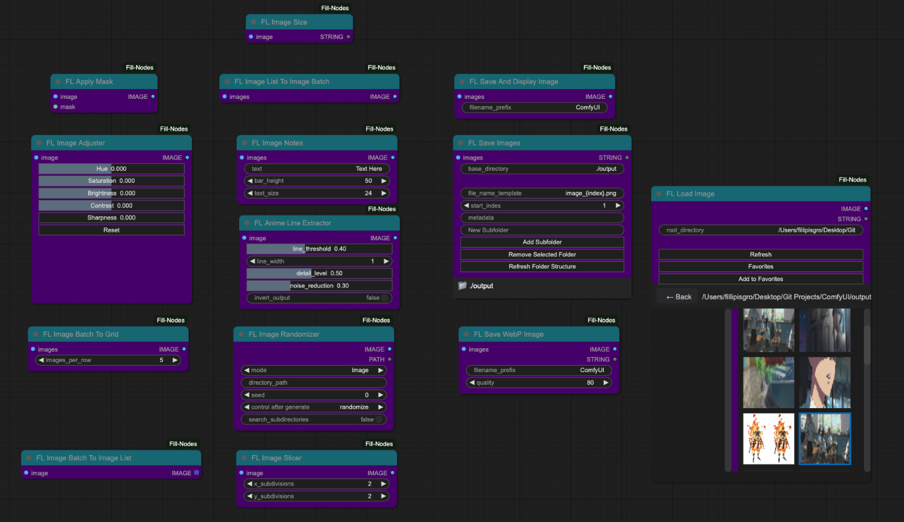

---

<h2 id="captioning-nodes">📝 Captioning Nodes</h2>

> *Nodes for generating, saving, and manipulating image and video captions.*

| Node | Description |
|------|-------------|
| `FL_Caption_Saver_V2` | Saves images with associated text captions, supporting both single and multiple image inputs from directories or tensors. Features include customizable output folder, optional downsizing, and the ability to preserve original filenames or generate new ones with overwrite protection. |
| `FL_CaptionToCSV` | Scans a directory for image files and their corresponding text captions, then compiles them into a CSV file with image filename and caption columns. Automatically handles missing caption files and sorts entries for consistency. |
| `FL_Image_Caption_Saver` | Saves images in PNG format with associated text captions in separate TXT files within a specified folder. Features text sanitization to remove problematic characters and optional file overwrite protection to prevent accidental data loss. |
| `FL_ImageCaptionLayout` | Creates visual layouts combining images with their corresponding text captions from a directory. Supports customizable grid arrangements with configurable image size, caption height, font size, and padding, automatically wrapping text to fit within the allocated caption area. |
| `FL_ImageCaptionLayoutPDF` | Creates PDF documents displaying a grid of images with their corresponding captions, with options for horizontal or vertical orientation. Provides both the PDF output and a preview image tensor with configurable display size, caption height, font size, and padding. |
| `FL_MirrorAndAppendCaptions` | Processes a directory of images to create horizontally mirrored copies and updates caption files with additional text. Supports both appending and prepending frame identifiers to captions with proper file extension handling and consistent frame numbering across the collection. |
| `FL_OllamaCaptioner` | Integrates with Ollama local LLM API to generate descriptive captions for images. Encodes images as base64 for API submission, saves both images and generated captions to disk with configurable overwrite protection and customizable model selection. |
| `FL_Video_Caption_Saver` | Converts image sequences to video with configurable format, quality, and frame rate while simultaneously saving an associated caption in a text file. Handles proper sanitization of both filenames and caption text with options for overwriting protection to prevent accidental data loss. |

### 📷 Screenshots & Examples

---

<h2 id="vfx-nodes">✨ VFX Nodes</h2>

> *Nodes for applying visual effects to images.*

| Node | Description |
|------|-------------|
| `FL_Ascii` | Converts images to ASCII art using customizable characters, fonts and spacing. Supports using characters in sequence or mapping them by pixel intensity, with options to use system or local fonts. |
| `FL_Dither` | Applies various dithering algorithms (Floyd-Steinberg, Random, Ordered, Bayer) to images with adjustable color quantization. Supports batch processing and preserves original image dimensions while reducing the color palette to create retro-style visual effects. |
| `FL_Glitch` | Creates digital glitch effects on images using the glitch_this library with adjustable intensity and optional color offset. Implements a double-pass glitch effect with rotation between passes to create more complex distortions, and supports deterministic output through seed control. |
| `FL_HalfTone` | Applies halftone patterns to images by converting them to grayscale and replacing continuous tones with patterns of dots. Features adjustable dot size and spacing parameters to control the final appearance, creating a classic print-like effect with variable density based on the original image brightness. |
| `FL_HexagonalPattern` | Creates a mosaic of hexagon-shaped image segments with customizable sizing, spacing, rotation, and shadow effects. Transforms input images into an artistic hexagonal grid pattern with adjustable parameters for visual styling. |
| `FL_InfiniteZoom` | Creates mesmerizing infinite zoom effects using OpenGL shaders with customizable scale, mirror effects, and animation speed. Processes both individual images and batches with progressive time shifts to create seamless zoom animations when combined into video. |
| `FL_PaperDrawn` | Applies a realistic hand-drawn paper effect using OpenGL shaders with adjustable parameters for line quality, sampling, and vignetting. Processes images through a custom gradient-based algorithm that simulates pen strokes with configurable density and temporal modulation for animations. |
| `FL_PixelArt` | Transforms images into pixel art with adjustable pixel size, color depth, and optional color palette extraction. Supports masking for selective application and aspect ratio preservation, using color quantization and nearest-neighbor scaling to create authentic pixel art aesthetics. |
| `FL_PixelSort` | Applies pixel sorting effects based on saturation values with adjustable threshold, smoothing, and rotation parameters. Creates glitch art aesthetics by identifying intervals in the image and sorting pixels within those intervals according to their color properties. |
| `FL_RetroEffect` | Applies retro visual effects to images including color channel offset, scanlines, vignetting, and noise with adjustable strength parameters. Creates nostalgic aesthetics reminiscent of old CRT displays and vintage photography through multiple image processing techniques. |
| `FL_Ripple` | Creates dynamic ripple and wave effects emanating from a configurable center point with adjustable amplitude, frequency, and phase settings. Supports temporal modulation for animated sequences and provides precise control over the distortion pattern and intensity. |
| `FL_Shader` | Applies customizable OpenGL fragment shaders to images with full Shadertoy compatibility, supporting time-based animation and up to four input image channels. Renders shaders with precise control over dimensions, frame count, and FPS for creating complex procedural effects or animations. |

### 📷 Screenshots & Examples

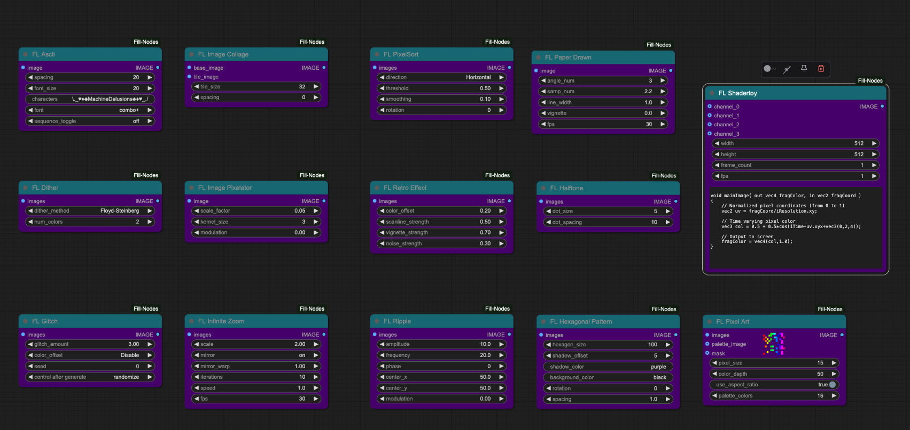

---

<h2 id="utility-nodes">🛠️ Utility Nodes</h2>

> *General utility nodes for various tasks.*

| Node | Description |
|------|-------------|
| `FL_Code_Node` | Executes custom Python code either from direct input or from an external file with four generic output slots. Provides a pre-configured execution environment with 'inputs' and 'outputs' dictionaries, allowing complex custom logic to be integrated directly into ComfyUI workflows. |
| `FL_DirectoryCrawl` | Recursively searches directories for image or text files and loads them as a batch. Supports configurable file type filtering, automatic image resizing to match dimensions within batches, and limits to prevent overloading memory with large directories. |
| `FL_ImageCollage` | Creates collages by tiling a smaller image across a base image, with the tiles colored based on the average color of the corresponding region. Supports customizable tile size and spacing with automatic handling of mismatched batch sizes and aspect ratio preservation. |
| `FL_InpaintCrop` | Crops images for inpainting based on mask regions with advanced context expansion options and automatic padding controls. Provides both free-size and forced-size modes with optional rescaling, hole filling, and mask inversion for precise control over the inpainting area. |
| `FL_Padding` | Adds customizable padding to images with independently configurable top, bottom, left, and right border widths. Supports RGB color selection for padding areas and optional alpha channel preservation with proper tensor handling. |
| `FL_PasteOnCanvas` | Pastes images onto a canvas with alpha masking, supporting custom canvas dimensions, background color, padding, and multiple resize algorithms. Automatically handles batch processing with proper alpha blending and optional use of background images. |
| `FL_PathTypeChecker` | Analyzes input paths and identifies their type (absolute, relative, drive-specific, UNC, or URL-like). Provides path validation and classification to help identify potential issues with file system references. |
| `FL_RandomRange` | Generates both integer and floating-point random numbers within a specified range with optional seed control. Ensures reproducible output when a seed is provided, while offering random generation mode when seed is set to zero. |
| `FL_SaveImages` | Saves batch-processed images to disk with support for complex folder structures defined through JSON configuration. Features sequential file naming with configurable templates, optional metadata storage, and collision avoidance through automatic index incrementation. |
| `FL_SaveWebpImages` | Extends ComfyUI's SaveImage node to output WebP format images with adjustable quality settings. Returns both the saved images as tensors and a message indicating the number of successfully saved files, combining display functionality with format-specific optimization. |
| `FL_SD_Slices` | Divides input images into configurable grid patterns with specified number of slices on both X and Y axes, supporting a multiplier parameter for flexible slice sizing. Returns the original image along with slice dimensions and multiplier values for efficient processing in downstream Stable Diffusion operations. |
| `FL_SeparateMaskComponents` | Analyzes masks and separates them into individual component masks based on connected components analysis. Outputs both the separated mask tensors and mappings to their original batch indices, enabling advanced mask manipulation for selective processing. |
| `FL_SystemCheck` | Performs comprehensive system diagnostics gathering detailed information about Python version, operating system, hardware specifications, and installed libraries. Exposes a web API endpoint for retrieving system information in JSON format to aid with troubleshooting and compatibility verification. |

### 📷 Screenshots & Examples

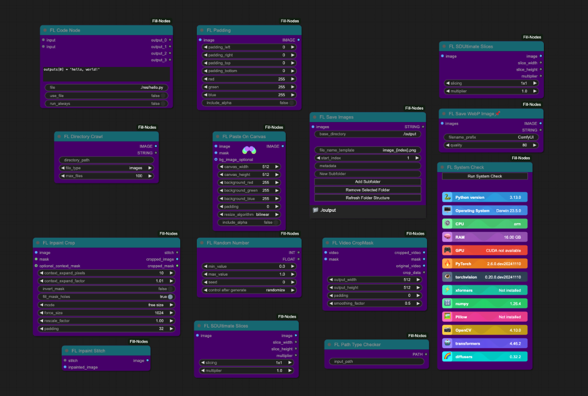

---

<h2 id="ksamplers-nodes">🎲 KSamplers Nodes</h2>

> *Nodes for sampling in the generation process.*

| Node | Description |
|------|-------------|
| `FL_KsamplerBasic` | Provides a streamlined implementation of ComfyUI's KSampler with support for both latent and direct image inputs. Handles all essential sampling parameters with proper error handling and integration with VAE encoding/decoding functions. |
| `FL_KsamplerFractals` | Implements a recursive fractal sampling algorithm that progressively upscales and refines latent images with diminishing denoise strength at each recursion level. Creates complex recursive structure by dividing images into slices and applying controlled randomness with a blend factor between iterations. |
| `FL_KsamplerPlus` | Advanced KSampler that processes images by dividing them into overlapping slices and seamlessly blending the results. Supports configurable grid dimensions, overlap percentages, optional sliced conditioning for each region, and batch processing with progressive memory management. |
| `FL_KsamplerSettings` | Provides a comprehensive preset system for aspect ratios and dimensions optimized for different model types (SD, SV3D, SD2, XL). Outputs coordinated settings for two-pass workflows with separate steps, CFG values, and denoise settings along with properly configured sampler and scheduler selections. |
| `FL_KSamplerXYZPlot` | Creates comprehensive grid comparisons by varying up to three KSampler parameters simultaneously. Generates labeled visual matrices showing the impact of changing steps, CFG, denoise values, samplers or schedulers, with professional-looking axes, labels and optional Z-dimension stacking in vertical or horizontal arrangements. |
| `FL_SamplerStrings` | Generates comma-separated strings of sampler names based on boolean selections, providing a streamlined interface for sampler combination and configuration. Creates standardized sampler strings compatible with ComfyUI's KSampler nodes for consistent workflow integration. |
| `FL_SchedulerStrings` | Generates comma-separated strings of scheduler names based on boolean selections, providing a streamlined interface for scheduler configuration. Creates standardized scheduler strings compatible with ComfyUI's KSampler nodes for consistent workflow integration. |

### 📷 Screenshots & Examples

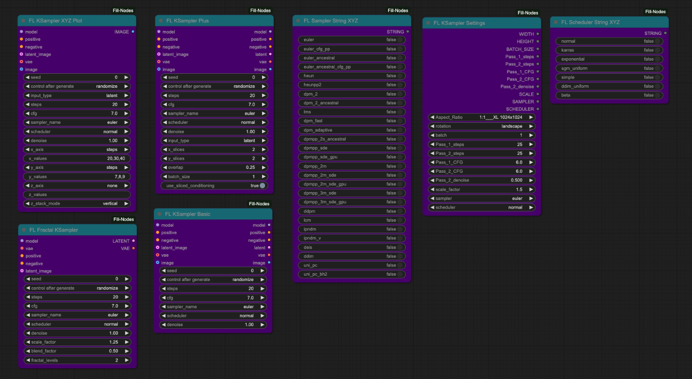

---

<h2 id="pdf-nodes">📄 PDF Nodes</h2>

> *Nodes for working with PDF files.*

| Node | Description |
|------|-------------|
| `FL_BulkPDFLoader` | Loads all PDF files from a specified directory with error handling and reporting. Returns metadata including file path, filename, page count, and binary content for each successfully loaded PDF. |
| `FL_ImagesToPDF` | Converts batched image tensors into a PDF document with one image per page. Supports configurable DPI and standard page sizes (A4, Letter, Legal) with automatic image resizing and centering to fit the selected page format. |
| `FL_PDFImageExtractor` | Extracts embedded images from PDF files with support for various image encoding formats including JPEG, PNG, and other compression methods. Provides filtering by minimum width/height dimensions and returns extracted images as tensors ready for processing. |
| `FL_PDFLoader` | Loads PDF files from disk and returns structured data including the file path, page count, and binary content. Performs format validation to ensure the input file is a valid PDF before loading. |
| `FL_PDFMerger` | Combines two PDF files into a single document by appending the pages of the second PDF after the first. Returns the merged PDF content in memory with updated page count information for further processing or saving. |
| `FL_PDFSaver` | Saves PDF data to disk with configurable output directory and filename options. Ensures proper file extension handling and directory creation if needed, returning the full path to the saved PDF file. |
| `FL_PDFTextExtractor` | Extracts all text content from PDF documents, combining text from multiple pages with proper spacing. Returns the complete extracted text as a single string with page separators for structured extraction. |
| `FL_PDFToImage` | Converts PDF pages to images with configurable DPI settings for quality control. Uses PyMuPDF to render high-quality representations of each page, returning all pages as a batched tensor ready for image processing workflows. |

### 📷 Screenshots & Examples

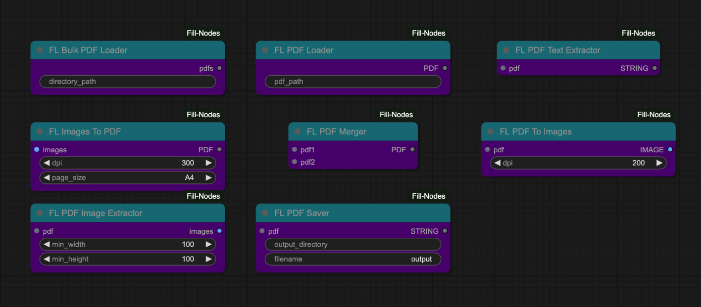

---

<h2 id="gpt-nodes">🤖 GPT Nodes</h2>

> *Nodes for integrating with GPT and other AI models.*

| Node | Description |
|------|-------------|
| `FL_Dalle3` | Integrates OpenAI's DALL-E 3 image generation API into ComfyUI with support for different resolutions, quality settings, and style options. Includes batch processing, automatic image saving, retry functionality, and returns both generated images and the revised prompts used by the DALL-E 3 model. |
| `FL_GPT_Vision` | Integrates with OpenAI's GPT Vision models (GPT-4o, GPT-4o-mini, GPT-4-vision-preview) to analyze and caption images. Features batch processing with configurable system prompts, detail levels, and temperature settings, while saving both images and associated captions to disk with optional overwrite protection. |
| `FL_SimpleGPTVision` | Integrates OpenAI's GPT Vision models (GPT-4o-mini, GPT-4o, GPT-4-vision-preview) to analyze images and generate text descriptions. Features customizable system prompts, user requests, and generation parameters while using environment variables for secure API key handling. |
| `FL_GeminiVideoCaptioner` | Captions videos using Google's Gemini AI models with support for both file input and image sequence batches. Automatically converts videos to WebM format with size optimization to meet API limitations, and provides configurable parameters for controlling model behavior and output length. |

### 📷 Screenshots & Examples

---

<h2 id="experimental-nodes">🧪 Experimental Nodes</h2>

> *Experimental nodes with various functionalities.*

| Node | Description |
|------|-------------|
| `FL_BatchAligned` | Implements style alignment across batches by sharing attention layers and normalization. Supports customizable sharing of query, key, and value vectors with AdaIN normalization and scale adjustments. |
| `FL_ColorPicker` | Simple interface for selecting and outputting color values in hexadecimal format. Takes a hex color string input (e.g., #FF0000) and passes it through to other nodes, enabling color selection within workflows. |
| `FL_GradGen` | Generates customizable color gradients with support for RGB and HSV color modes and various interpolation methods (Linear, Ease In, Ease Out, Ease In-Out). Allows creating complex multi-color gradients by defining color stops with positions, and outputs tensor images at specified dimensions. |
| `FL_NFTGenerator` | Selects images from a directory based on rarity percentages encoded in filenames following a specific format. Uses seed-based randomization to determine selection probability, automatically finds corresponding mask files, and outputs both the selected image and its mask as tensors. |

### 📷 Screenshots & Examples

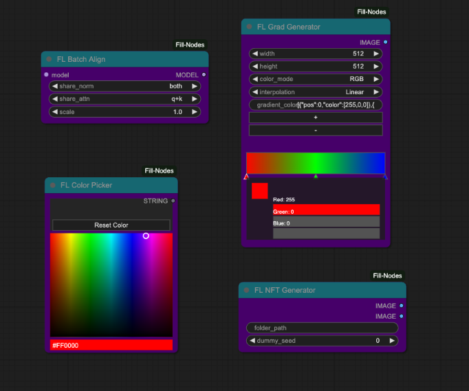

---

<h2 id="prompting-nodes">💬 Prompting Nodes</h2>

> *Nodes for generating and manipulating prompts.*

| Node | Description |
|------|-------------|
| `FL_MadLibGenerator` | Creates randomized text by replacing delimiters in a template with words from five configurable word lists. Uses consistent seeding per list to ensure reproducible results, with support for custom delimiters and separate RNG states for each word list. |
| `FL_PromptSelector` | Selects a single prompt from a multi-line text input based on a specified index, with options to prepend and append additional text. Provides error handling for index out-of-range conditions and automatic text formatting with proper spacing. |

### 📷 Screenshots & Examples

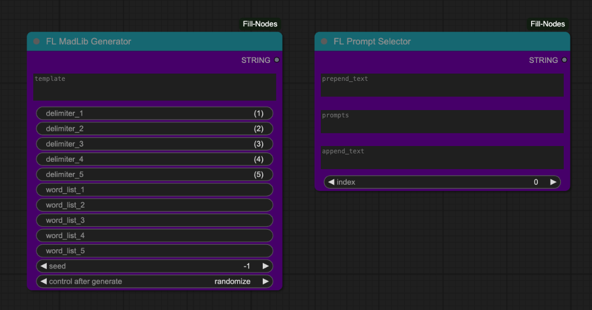

---

<h2 id="file-operation-nodes">📂 File Operation Nodes</h2>

> *Nodes for file operations.*

| Node | Description |
|------|-------------|
| `FL_ZipDirectory` | Compresses entire directory structures into zip archives with relative path preservation and efficient compression settings. Processes files using a temporary storage area and returns the resulting zip data for further handling in workflows. |
| `FL_ZipSave` | Compresses files from a specified input directory into a zip archive and saves it to a target location with customizable filename. Creates the output directory if it doesn't exist and ensures proper ZIP extension, returning the full path to the created archive. |

### 📷 Screenshots & Examples

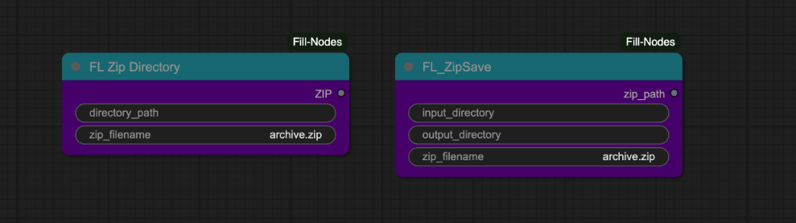

---

<h2 id="google-drive-nodes">☁️ Google Drive Nodes</h2>

> *Nodes for integrating with Google Drive.*

| Node | Description |
|------|-------------|
| `FL_GoogleDriveDownloader` | Downloads files from Google Drive using share links with automatic file ID extraction. Handles ZIP files by automatically extracting them to the specified output directory, with error handling and reporting for each step of the download process. |
| `FL_GoogleDriveImageDownloader` | Downloads image files specifically from Google Drive and automatically converts them to ComfyUI-compatible tensor format. Supports various image formats with automatic RGB conversion and proper tensor dimensioning, returning ready-to-use images for immediate integration into workflows. |

### 📷 Screenshots & Examples

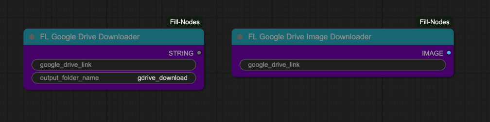

---

<h2 id="api-tool-nodes">🔌 API Tool Nodes</h2>

> *Nodes for API interactions.*

| Node | Description |
|------|-------------|
| `FL_API_Base64_ImageLoader` | Loads Base64-encoded images with support for automatic data URL prefix removal and image resizing. Preserves metadata like job_id, user_id, and category for API integration workflows. |
| `FL_API_ImageSaver` | Saves images to a categorized directory structure based on user_id and category parameters. Supports different image formats (PNG, JPEG, WebP) with configurable quality settings for web API integration. |

### 📷 Screenshots & Examples

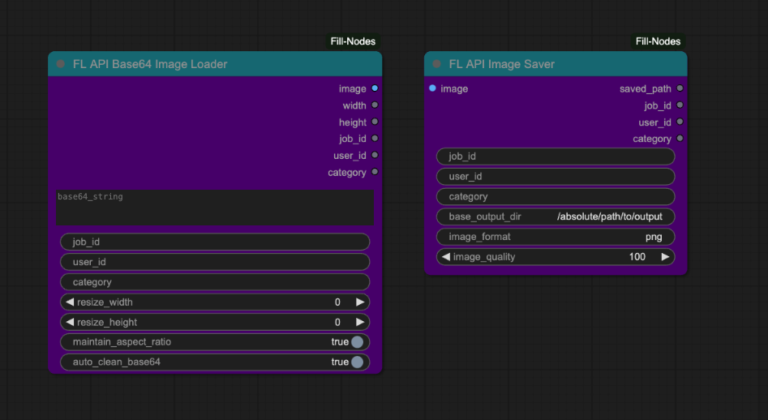

---

<h2 id="hugging-face-nodes">🤗 Hugging Face Nodes</h2>

> *Nodes for integrating with Hugging Face.*

| Node | Description |
|------|-------------|
| `FL_HF_Character` | Uploads character-related content to Hugging Face repositories with structured organization by studio, project, and character name. Supports multiple file types including LoRA models, datasets, image layouts, PDFs, and CSV files with comprehensive progress tracking. |
| `FL_HF_UploaderAbsolute` | Uploads files to Hugging Face repositories using absolute paths and reads API keys from environment variables. Supports various content types including LoRA models, datasets, images, PDFs, and CSV files with a simplified directory structure. |
| `FL_HFHubModelUploader` | Uploads models and associated files to Hugging Face Hub with support for creating new repositories or using existing ones. Features comprehensive upload capabilities for model files, images, ZIP archives, and README documentation with progress tracking and retry mechanisms. |

### 📷 Screenshots & Examples

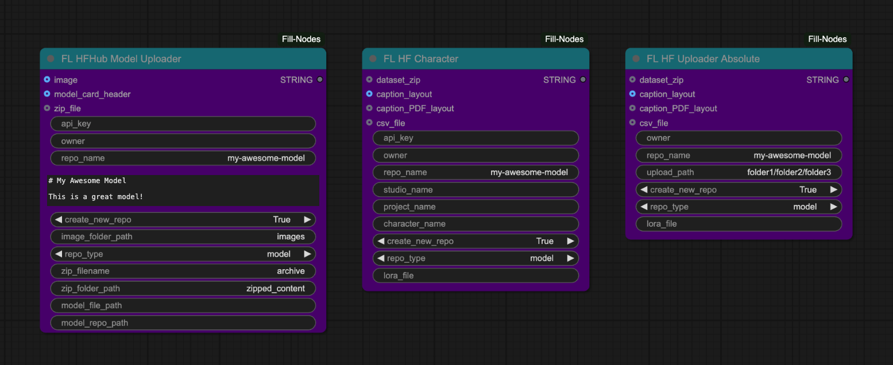

---

<h2 id="analysis-nodes">📊 Analysis Nodes</h2>

> *Nodes for analyzing images and other data.*

| Node | Description |
|------|-------------|
| `FL_ClipScanner` | Analyzes text prompts using different CLIP models (supporting SDXL, SD 1.5, and FLUX configurations) to show how they are tokenized. Provides detailed output showing the exact tokens processed, their count, and the specific model configuration used. |

### 📷 Screenshots & Examples

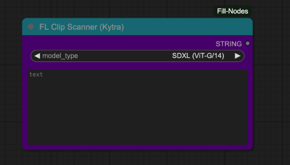

---

<h2 id="loader-nodes">⏬ Loader Nodes</h2>

> *Nodes for loading various resources.*

| Node | Description |
|------|-------------|
| `FL_NodeLoader` | Simple pass-through node that accepts and returns a TRIGGER input, designed to ensure custom nodes are loaded when a workflow is executed. Acts as a lightweight utility for controlling workflow execution order. |
| `FL_UpscaleModel` | Processes images through upscaling models with support for batch processing, precision control, and optional downscaling for fine-tuned results. Features progress tracking for large batches and automatic handling of device-specific optimizations for both CPU and GPU processing. |

### 📷 Screenshots & Examples

---

<h2 id="discord-nodes">💬 Discord Nodes</h2>

> *Nodes for Discord integration.*

| Node | Description |
|------|-------------|
| `FL_DiscordWebhook` | Sends images or videos to Discord servers via webhooks with customizable usernames and messages. Automatically handles single images and image sequences, converting the latter to MP4 videos with adjustable frame rates before uploading to Discord. |

### 📷 Screenshots & Examples

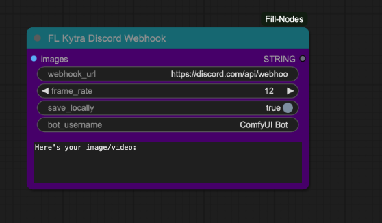

---

<h2 id="work-in-progress-nodes">🚧 Work-in-Progress Nodes</h2>

> *Nodes that are still in development.*

| Node | Description |
|------|-------------|
| `FL_HunyuanDelight` | Integrates Tencent's Hunyuan3D-2 model for image-to-image transformations with automatic model downloading and loading. Supports batch processing with adjustable parameters for image guidance, steps, and multiple processing loops for iterative refinement. |
| `FL_TimeLine` | Processes timeline data for creating animated sequences with support for different interpolation modes, resolution settings, and frame rate controls. Includes an API endpoint for handling timeline data within the ComfyUI server architecture, enabling advanced animation workflows. |

### 📷 Screenshots & Examples

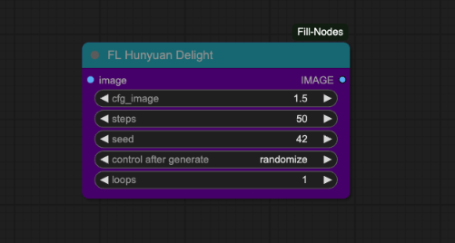

---

<h2 id="game-nodes">🎮 Game Nodes</h2>

> *Nodes implementing games.*

| Node | Description |
|------|-------------|
| `FL_BulletHellGame` | Implements a playable bullet hell-style shooter game within the ComfyUI interface where players control a ship with mouse movements and combat enemy ships that fire various bullet patterns. Features include multiple enemy ships with different attack patterns, player-guided bullets that track enemies, level progression, and score tracking. |
| `FL_TetrisGame` | Implements a fully playable Tetris game within ComfyUI's interface using standard keyboard controls (arrow keys) for movement, rotation, and acceleration. Features include complete tetromino collision detection, line clearing mechanics, game over detection, and a responsive canvas that adjusts to the node's dimensions. |

### 📷 Screenshots & Examples

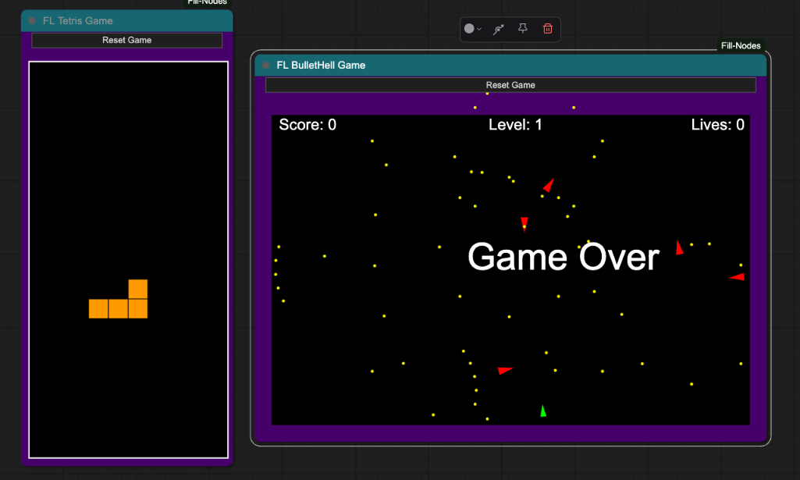

---

<h2 id="math-nodes">🧮 Math Nodes</h2>

> *Nodes for mathematical operations.*

| Node | Description |
|------|-------------|
| `FL_Math` | Evaluates mathematical expressions using three input variables (A, B, C) with support for basic operations, powers, and negative values. Provides both integer and floating-point outputs with proper error handling for invalid expressions. |

### 📷 Screenshots & Examples

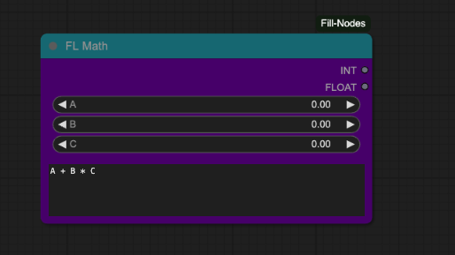

---

<h2 id="video-nodes">🎬 Video Nodes</h2>

> *Nodes for video processing.*

| Node | Description |
|------|-------------|
| `FL_ProResVideo` | Creates professional-quality ProRes videos from image sequences with configurable FPS and output settings. Uses a two-step process with temporary MP4 creation followed by FFmpeg conversion to ProRes 4444 format with high-quality settings optimized for post-production workflows. |
| `FL_SceneCut` | Analyzes a batch of images representing video frames to detect scene cuts using optimized intensity thresholding and histogram comparison. Saves each detected scene as an individual MP4 file in the specified output folder and returns the paths to these files. |
| `FL_VideoCropNStitch` | Processes video frames by dynamically cropping around mask regions with temporal smoothing to maintain stable motion. Includes companion recomposition functionality to place the processed crops back into the original frames while preserving aspect ratios and dimensions. |

### 📷 Screenshots & Examples

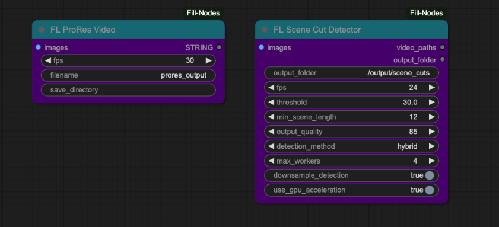

---

<h2 id="ai-nodes">🧠 AI Nodes</h2>

> *Nodes that integrate with various AI models.*

| Node | Description |
|------|-------------|
| `FL_HunyuanDelight` | Integration with Hunyuan AI models |

### 📷 Screenshots & Examples

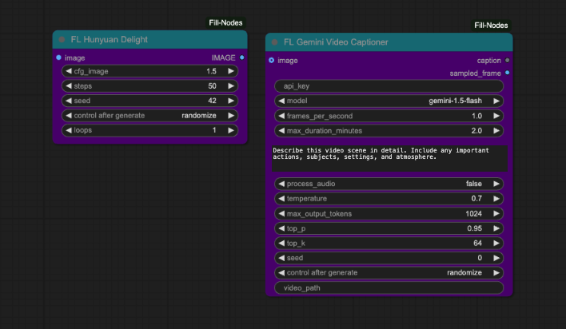

---

<h2 id="utils">🔧 Utils</h2>

> *Utility nodes for the system.*

| Node | Description |
|------|-------------|
| `FL_NodePackLoader` | Enhanced trigger node that forces processing on every execution regardless of input changes. Uses NaN for change detection to ensure the node always executes when triggered, providing a reliable mechanism for loading node packs. |

### 📷 Screenshots & Examples

---